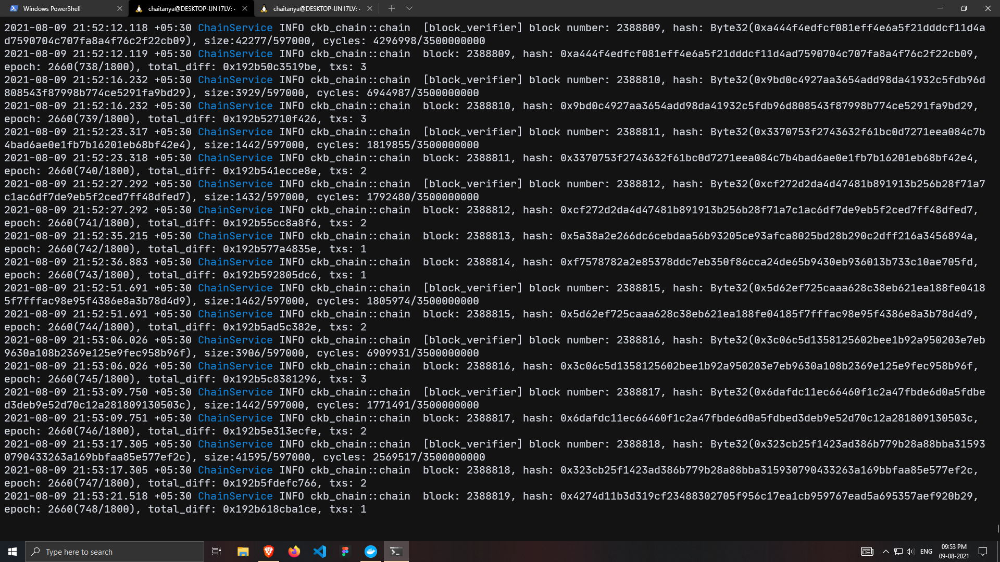
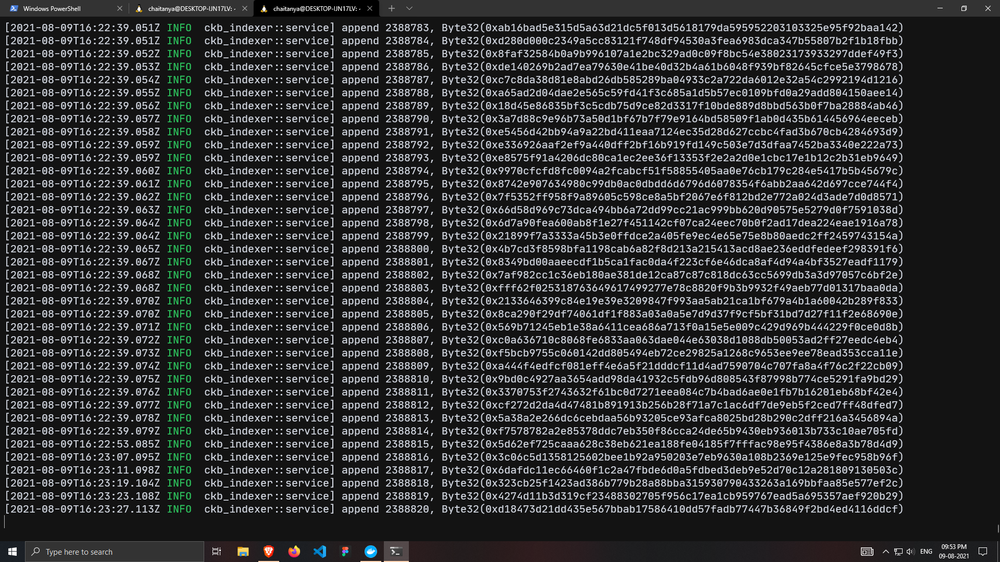

# Nervos-Hakathon-Task-0

1. Screenshot of the console output from your local Testnet CKB Node after it has fully synchronized with the network.

2. Screenshot of the console output from your local CKB Indexer after it has fully synchronized with the local Testnet CKB Node.
		