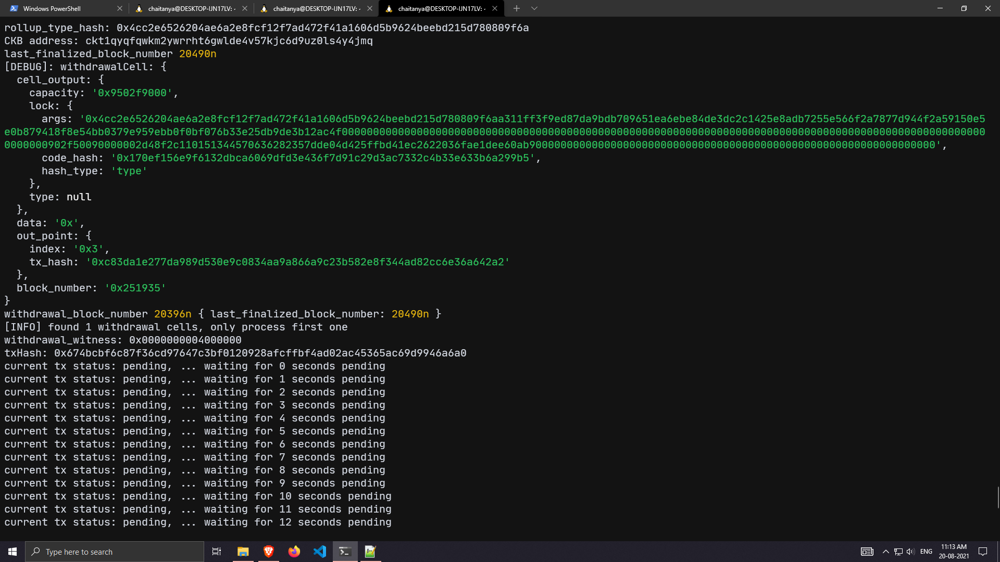
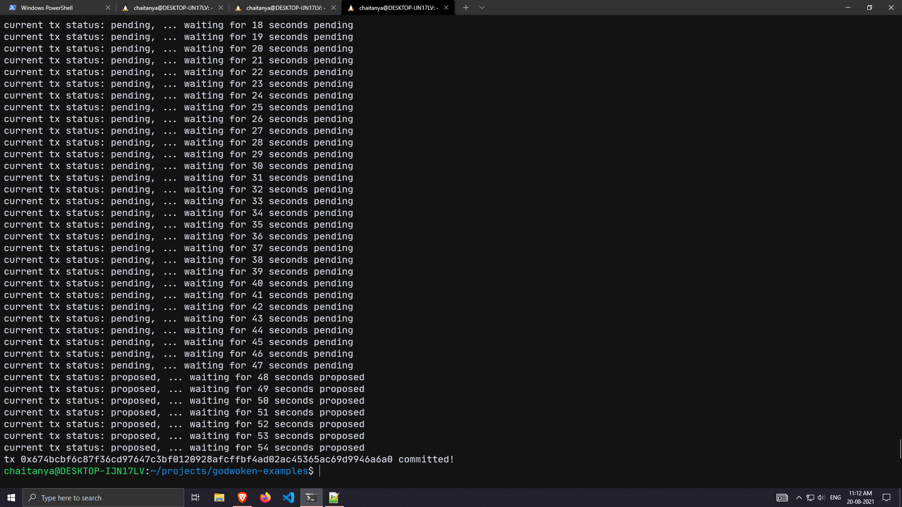

# Nervos-Hakathon-Task-10

1. A screenshot of the console output immediately after running the "unlock" command.



2. The Ethereum address that you've used for your Layer 2 account.
```
0x7a1dBEc6f1203F89942766314bE0f36FD4615704
```

3. The Nervos Layer 1 address associated with the private key passed to "unlock" command.
```
ckt1qyqfqwkm2ywrrht6gwlde4v57kjc6d9uz0ls4y4jmq
```
