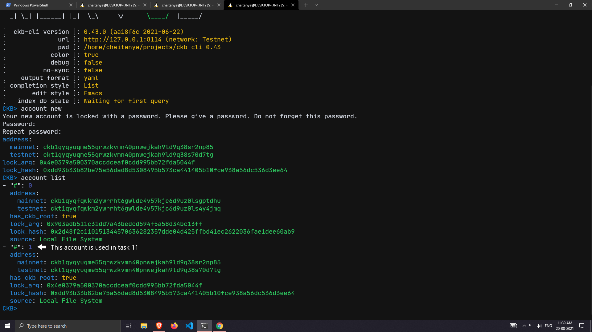
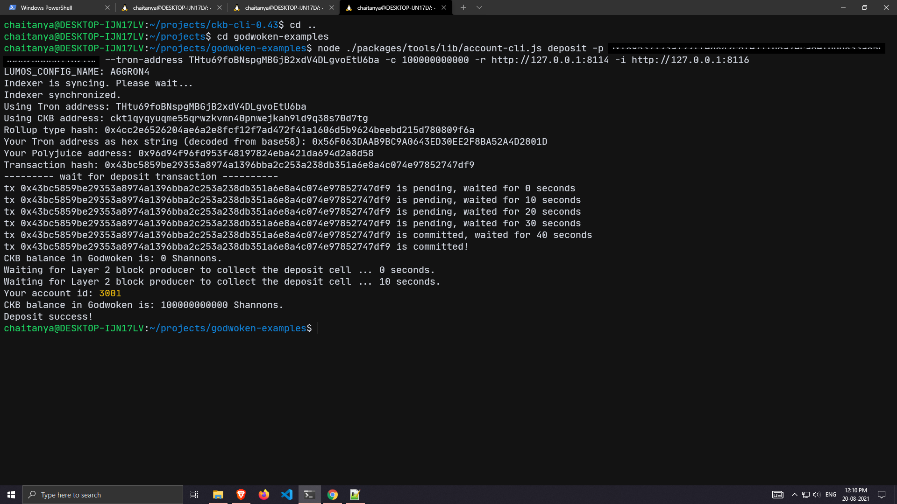
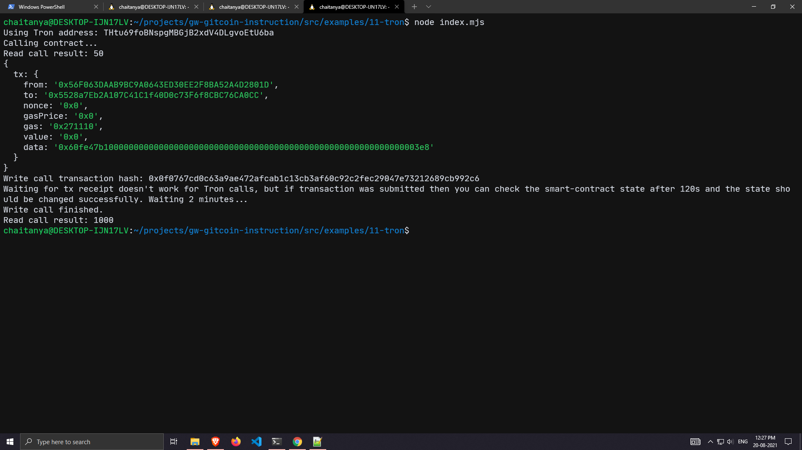

# Nervos-Hakathon-Task-11

1. A screenshot of the accounts you created (account list) in ckb-cli.


2. A link to the Layer 1 address you funded on the Testnet Explorer.

	https://explorer.nervos.org/aggron/address/ckt1qyqyuqme55qrwzkvmn40pnwejkah9ld9q38s70d7tg

3. A screenshot of the console output immediately after you have successfully submitted a CKByte deposit to your Tron account on Layer 2.


4. A screenshot of the console output immediately after you have successfully issued a smart contract calls on Layer 2.


5. The transaction hash of the "Contract call" from the console output.
```
0x0f0767cd0c63a9ae472afcab1c13cb3af60c92c2fec29047e73212689cb992c6
```

6. The contract address that you called.
```
0x5528a7Eb2A107C41C1f40D0c73F6f8CBC76CA0CC
```

7. The ABI for contract you made a call on.
```
[
    {
      "inputs": [],
      "stateMutability": "payable",
      "type": "constructor"
    },
    {
      "inputs": [
        {
          "internalType": "uint256",
          "name": "x",
          "type": "uint256"
        }
      ],
      "name": "set",
      "outputs": [],
      "stateMutability": "payable",
      "type": "function"
    },
    {
      "inputs": [],
      "name": "get",
      "outputs": [
        {
          "internalType": "uint256",
          "name": "",
          "type": "uint256"
        }
      ],
      "stateMutability": "view",
      "type": "function"
    }
]
```

8. Your Tron address.
```
THtu69foBNspgMBGjB2xdV4DLgvoEtU6ba
```
