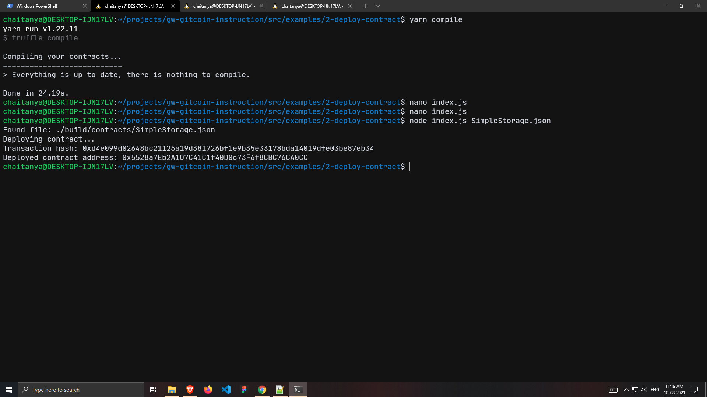

# Nervos-Hakathon-Task-2

1. Screenshot of the console output immediately after successfully deploying a smart contract.

2. The transaction hash from the contract deployment.
`0xd4e099d02648bc21126a19d381726bf1e9b35e33178bda14019dfe03be87eb34`

3. The deployed contract address from the contract deployment.
`0x5528a7Eb2A107C41C1f40D0c73F6f8CBC76CA0CC`
