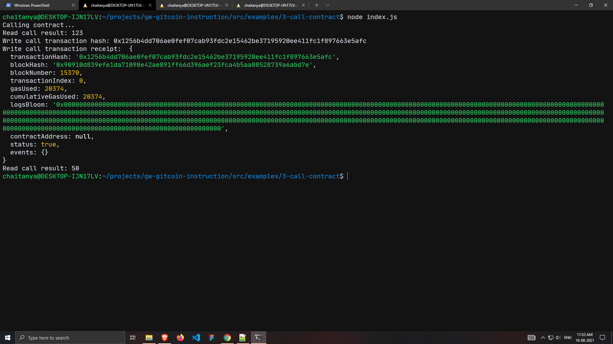

# Nervos-Hakathon-Task-3

1. Screenshot of the console output immediately after successfully issuing a smart contract call.


2. The transaction hash from the console output.
```
0x1256b4dd706ae0fef07cab93fdc2e15462be37195920ee411fc1f897663e5afc
```

3. The contract address that you called.
```
0x5528a7Eb2A107C41C1f40D0c73F6f8CBC76CA0CC
```

4. The ABI for contract you made a call on.
```
[
    {
      "inputs": [],
      "stateMutability": "payable",
      "type": "constructor"
    },
    {
      "inputs": [
        {
          "internalType": "uint256",
          "name": "x",
          "type": "uint256"
        }
      ],
      "name": "set",
      "outputs": [],
      "stateMutability": "payable",
      "type": "function"
    },
    {
      "inputs": [],
      "name": "get",
      "outputs": [
        {
          "internalType": "uint256",
          "name": "",
          "type": "uint256"
        }
      ],
      "stateMutability": "view",
      "type": "function"
    }
]
```
