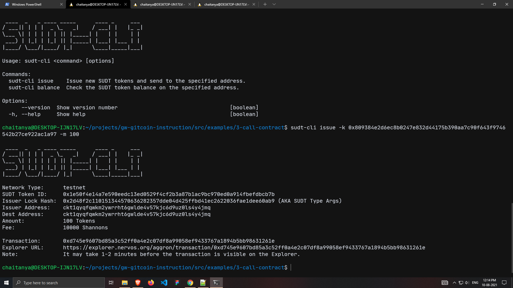
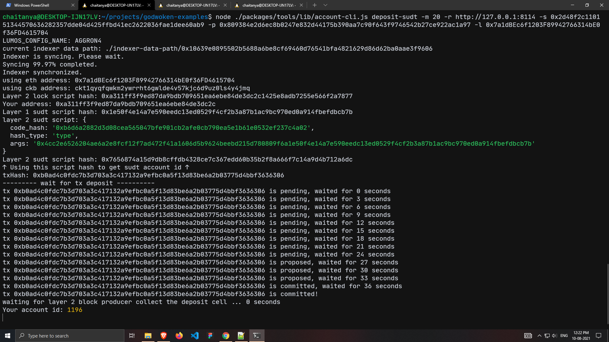
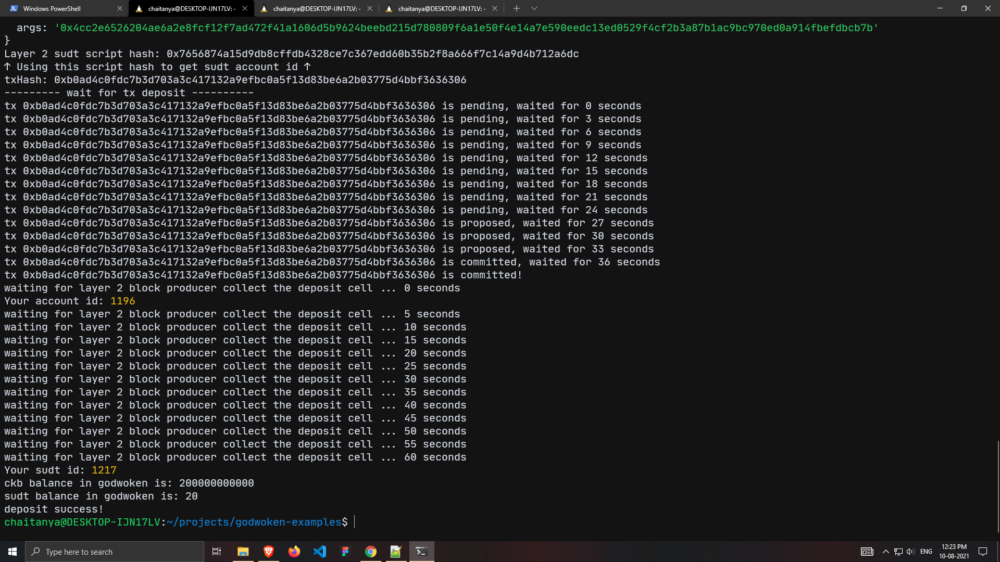

# Nervos-Hakathon-Task-4

1. A link to the Layer 1 address you funded on the Testnet Explorer.
https://explorer.nervos.org/aggron/address/ckt1qyqfqwkm2ywrrht6gwlde4v57kjc6d9uz0ls4y4jmq

2. A screenshot of the console output immediately after using sudt-cli to create your SUDT tokens on Layer 1.


3. A link to the transaction ID created by sudt-cli on the Testnet Explorer.
https://explorer.nervos.org/aggron/transaction/0xd745e9607bd85a3c52ff0a4e2c07df8a99058ef9433767a1894b5bb98631261e

4. A screenshot of the console output immediately after you have successfully submitted a deposit to Layer 2 using the account-cli tool.



5. The SUDT ID from the console output after executing the deposit script.
```
1217
```
