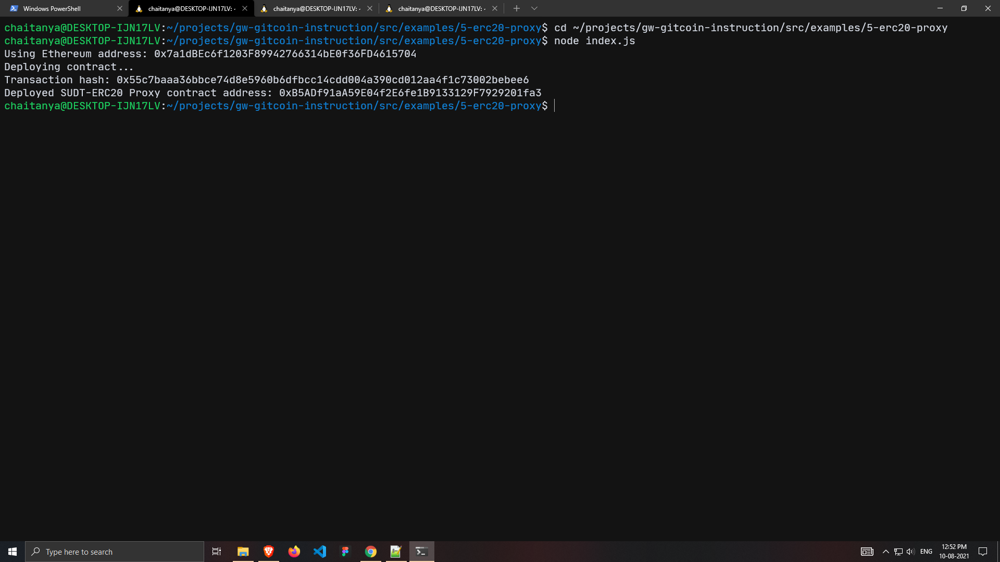
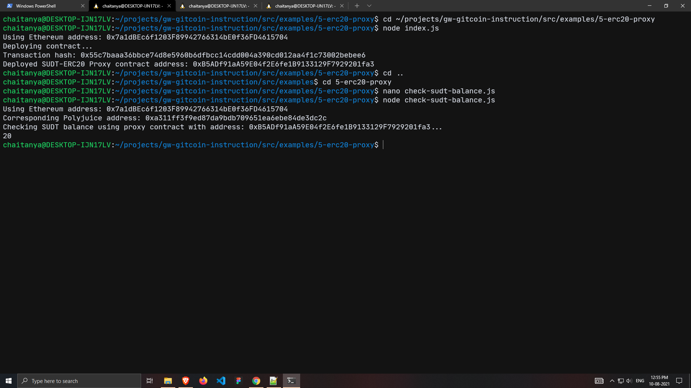

# Nervos-Hakathon-Task-5

1. A screenshot of the console output immediately after deploying smart contract.


2. The address of the ERC20 Proxy Contract you deployed.
```
0xB5ADf91aA59E04f2E6fe1B9133129F7929201fa3
```

3. A screenshot of the console output immediately after checking your SUDT balance.


4. The Ethereum address that was checked.
```
0x7a1dBEc6f1203F89942766314bE0f36FD4615704
```
