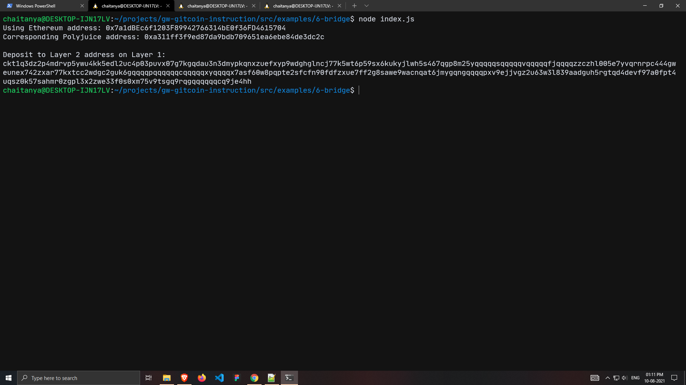

# Nervos-Hakathon-Task-6

1. A screenshot of the console output immediately after you have successfully generated your Deposit Receiver Address.


2. Your Deposit Receiver Address.
```
ckt1q3dz2p4mdrvp5ywu4kk5edl2uc4p03puvx07g7kgqdau3n3dmypkqnxzuefxyp9wdghglncj77k5wt6p59sx6kukyjlwh5s467qgp8m25yqqqqqsqqqqqvqqqqqfjqqqqzzczhl005e7yvqrnrpc444gweunex742zxar77kxtcc2wdgc2guk6gqqqqpqqqqqqcqqqqqxyqqqqx7asf60w8pqpte2sfcfn90fdfzxue7ff2g8sawe9wacnqat6jmygqngqqqqpxv9ejjvgz2u63w3l839aadguh5rgtqd4devf97a0fpt4uqsz0k57sahmr0zgpl3x2zwe33f0s0xm75v9tsgq9rqgqqqqqqcq9je4hh
```

3. The Ethereum address used to generate the Deposit Receiver Address.
```
0x7a1dBEc6f1203F89942766314bE0f36FD4615704
```

4. A link to the Etherscan explorer for the successful Force Bridge transaction.
https://rinkeby.etherscan.io/tx/0x85df1d64465d5b210192848c5ec5173b32680977e6b51dbf71d4ad42a9798de3

5. A link to the Nervos explorer for the successful Force bridge transaction.
https://explorer.nervos.org/aggron/transaction/0x54bdeffcc0d3b8043641a9d03745bf0f4a5276554a98a5f0a37069fdda8047d5