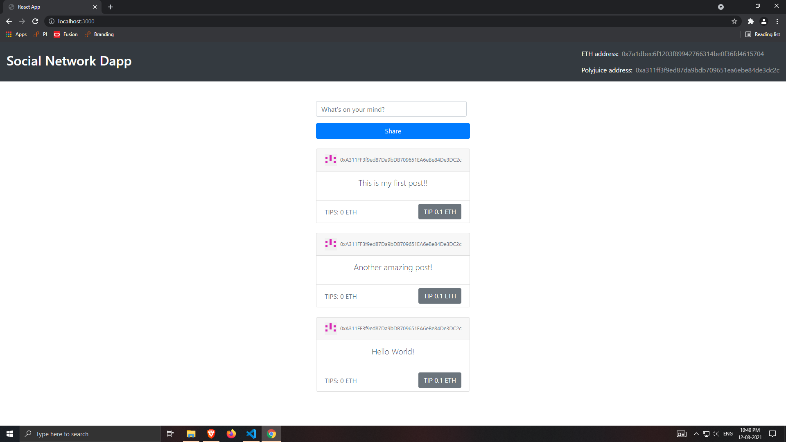
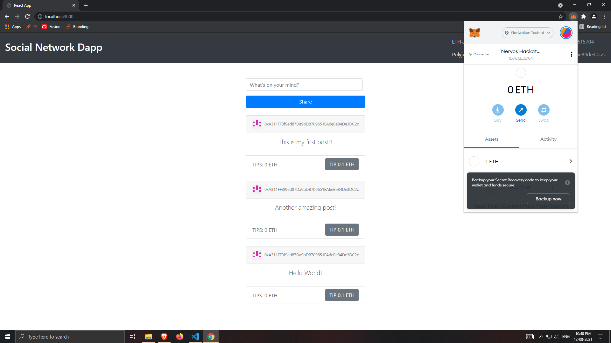
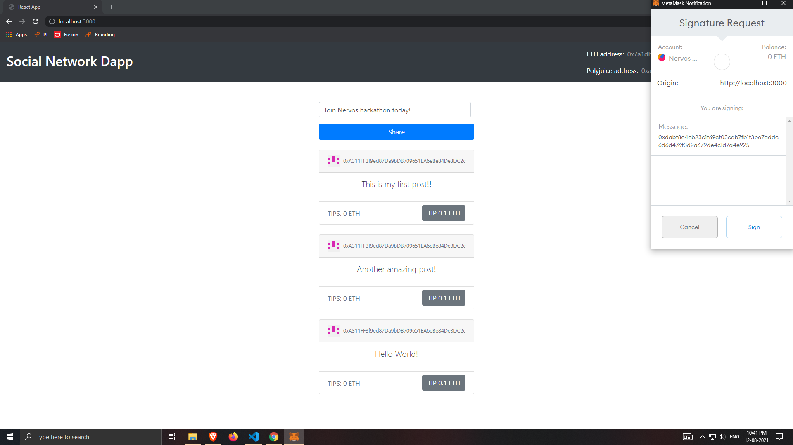
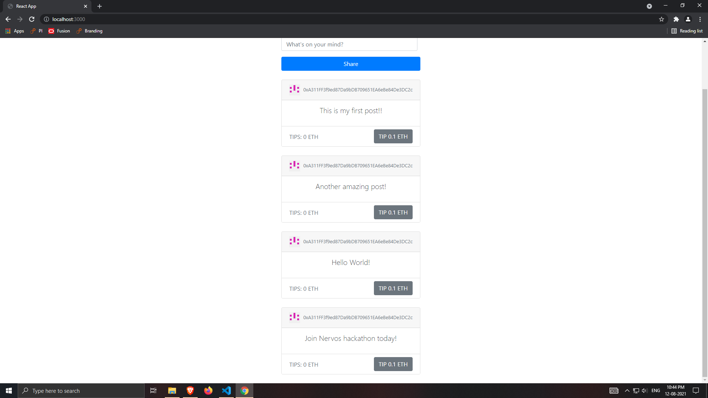

# Nervos-Hakathon-Task-7

1. Screenshots or video of your application running on Godwoken.





2. Link to the GitHub repository with your application which has been ported to Godwoken. 
https://github.com/chaitanyasjoshi/social-network-dapp-polyjuice

3. Transaction hash of the deployment transaction.
```
0x267e135940fcdb74a16c898e13a1c61719446932ca6f8359e0f698196ec59759
```

4. The deployed contract address.
```
0xE41377890e99E49983a2BA2Ba02E05E41e478AEB
```

5. ABI of the deployed smart contract.
```
[
    {
      "inputs": [],
      "payable": false,
      "stateMutability": "nonpayable",
      "type": "constructor"
    },
    {
      "anonymous": false,
      "inputs": [
        {
          "indexed": false,
          "internalType": "uint256",
          "name": "id",
          "type": "uint256"
        },
        {
          "indexed": false,
          "internalType": "string",
          "name": "content",
          "type": "string"
        },
        {
          "indexed": false,
          "internalType": "uint256",
          "name": "tipAmount",
          "type": "uint256"
        },
        {
          "indexed": false,
          "internalType": "address payable",
          "name": "author",
          "type": "address"
        }
      ],
      "name": "PostCreated",
      "type": "event"
    },
    {
      "anonymous": false,
      "inputs": [
        {
          "indexed": false,
          "internalType": "uint256",
          "name": "id",
          "type": "uint256"
        },
        {
          "indexed": false,
          "internalType": "string",
          "name": "content",
          "type": "string"
        },
        {
          "indexed": false,
          "internalType": "uint256",
          "name": "tipAmount",
          "type": "uint256"
        },
        {
          "indexed": false,
          "internalType": "address payable",
          "name": "author",
          "type": "address"
        }
      ],
      "name": "PostTipped",
      "type": "event"
    },
    {
      "constant": true,
      "inputs": [],
      "name": "name",
      "outputs": [
        {
          "internalType": "string",
          "name": "",
          "type": "string"
        }
      ],
      "payable": false,
      "stateMutability": "view",
      "type": "function"
    },
    {
      "constant": true,
      "inputs": [],
      "name": "postCount",
      "outputs": [
        {
          "internalType": "uint256",
          "name": "",
          "type": "uint256"
        }
      ],
      "payable": false,
      "stateMutability": "view",
      "type": "function"
    },
    {
      "constant": true,
      "inputs": [
        {
          "internalType": "uint256",
          "name": "",
          "type": "uint256"
        }
      ],
      "name": "posts",
      "outputs": [
        {
          "internalType": "uint256",
          "name": "id",
          "type": "uint256"
        },
        {
          "internalType": "string",
          "name": "content",
          "type": "string"
        },
        {
          "internalType": "uint256",
          "name": "tipAmount",
          "type": "uint256"
        },
        {
          "internalType": "address payable",
          "name": "author",
          "type": "address"
        }
      ],
      "payable": false,
      "stateMutability": "view",
      "type": "function"
    },
    {
      "constant": false,
      "inputs": [
        {
          "internalType": "string",
          "name": "_content",
          "type": "string"
        }
      ],
      "name": "createPost",
      "outputs": [],
      "payable": false,
      "stateMutability": "nonpayable",
      "type": "function"
    },
    {
      "constant": false,
      "inputs": [
        {
          "internalType": "uint256",
          "name": "_id",
          "type": "uint256"
        }
      ],
      "name": "tipPost",
      "outputs": [],
      "payable": true,
      "stateMutability": "payable",
      "type": "function"
    }
]
```