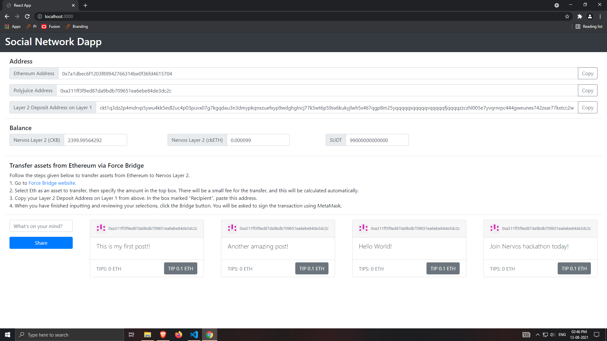
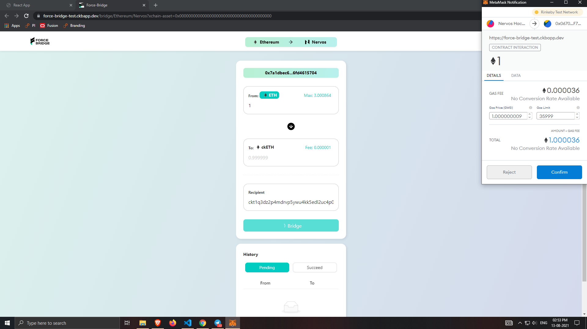
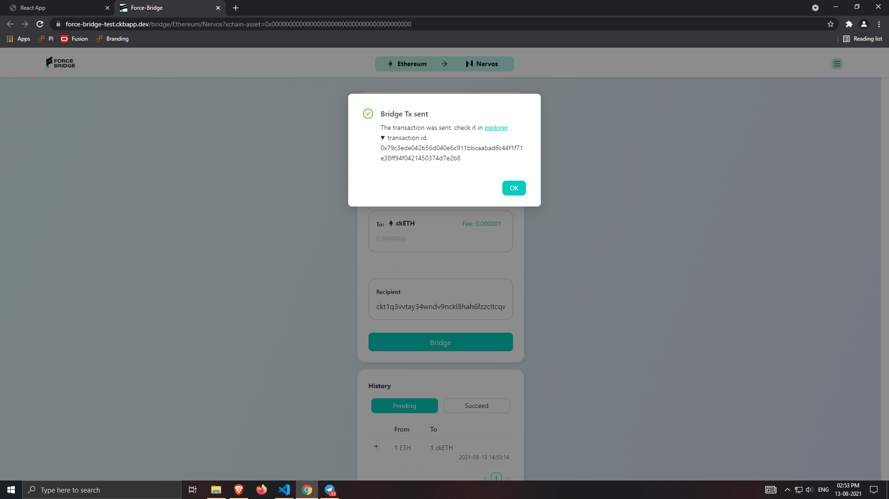
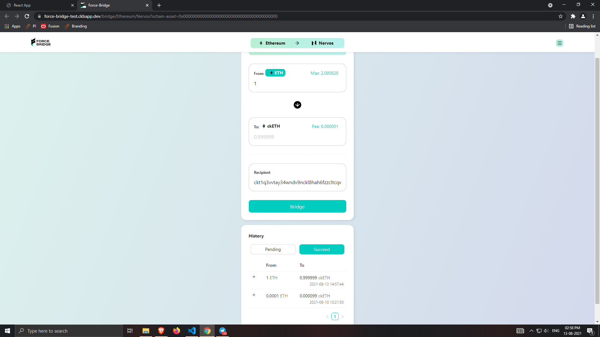
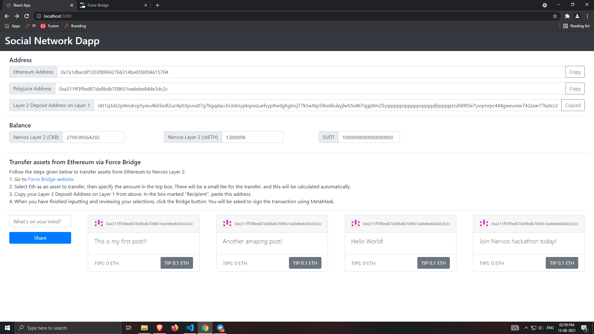

# Nervos-Hakathon-Task-7

1. A screenshot or video of your EVM application on Layer 2 with Force Bridge support.






2. The address of the SUDT-ERC20 Proxy Contract that you deployed.
```
0x5Aa3A57675D7F80f66Fa42B9d09626eB19c29D21
```

3. A link to the GitHub repository with your EVM application that integrates Force Bridge support.

	https://github.com/chaitanyasjoshi/social-network-dapp-force-bridge
